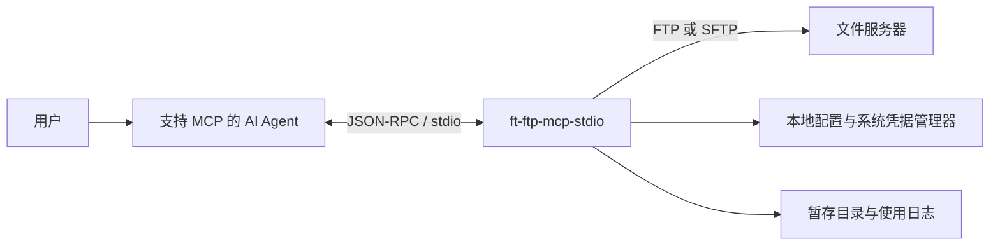

# FT Agent FTP 插件

FT Agent FTP 插件是一个通过 stdio 运行的本地 MCP Server，让支持 MCP 的 AI Agent 在受控范围内访问 FTP/SFTP 服务器。工程名、Python 包入口和 MCP 注册名统一使用 `ft-ftp-mcp-stdio`。

- 当前版本：`0.3.1`
- 支持的正式分发环境：Windows 10/11 x64 + Python 3.12.x
- 协议：FTP、SFTP
- 许可：MIT License

它提供服务器发现、目录浏览、文件搜索、上传下载、文本预览、目录批量传输及远程文件维护等 14 个 MCP 工具。服务不监听本地网络端口；每次远端工具调用独立建立并关闭 FTP/SFTP 连接。

## 核心特性

- **本地 stdio 服务**：由 MCP 客户端按需启动，不开放 HTTP/TCP 服务端口。
- **FTP 与 SFTP**：支持密码认证、SFTP 私钥认证和主机密钥校验。
- **凭据不进入模型上下文**：密码或私钥口令存入操作系统凭据管理器，也可由环境变量注入。
- **虚拟路径边界**：Agent 只使用以 `/` 开头的虚拟路径；`/` 映射到必填的服务器 `root`，真实 root 不进入工具结果。
- **写操作保护**：支持只读模式；覆盖、移动和删除均有明确门控。
- **大文件友好**：下载内容落入本机暂存目录，工具仅返回路径、元数据和 SHA-256。
- **上传完整性护栏**：上传逐文件执行大小限制，并通过同目录临时对象提交；下载校验已知远端大小并清理失败的部分文件。
- **中文环境兼容**：FTP 文件名支持 UTF-8、GBK 和自动回退；文本预览支持 BOM、UTF-8 与 GBK。
- **可诊断、可审计**：提供只读 `doctor` 检查和不含凭据、文件内容的本地 JSONL 使用日志。

## 工具一览

| 工具 | 用途 | 关键保护 |
| --- | --- | --- |
| `list_servers` | 列出已配置的逻辑服务器 | 只读本地配置，不连接远端、不读取凭据或触发 TOFU |
| `test_connection` | 测试连接、认证与账号访问范围 | 不执行文件操作 |
| `list_dir` | 列出指定目录的下一层内容 | 最多返回 500 项 |
| `search_files` | 按名称通配符递归搜索 | 深度最多 5 层，最多返回 50 项 |
| `get_file_info` | 获取文件或目录元信息 | 仅查询 |
| `download_file` | 下载单个文件到本机暂存目录 | 校验大小并返回 SHA-256 |
| `upload_file` | 上传单个本机文件 | 默认拒绝覆盖，覆盖需 `overwrite=true` |
| `make_dir` | 递归创建目录 | 幂等；只读服务器拒绝 |
| `read_text_preview` | 预览文本或 CSV 的开头部分 | 默认 100 KB，最大 1 MB，按完整行截断 |
| `download_dir` | 递归下载目录 | 跳过链接并逐项报告失败，不设置客户端数量或大小上限 |
| `upload_dir` | 递归上传目录 | 默认不覆盖，跳过软链接 |
| `rename` | 在同一目录中重命名 | 目标存在时拒绝 |
| `move` | 移动文件或目录 | 源与目标均进行路径边界检查 |
| `delete` | 删除文件或空目录 | 必须显式传入 `confirm=true` |

除无业务输入的 `list_servers` 外，所有远端操作工具都接受可选的 `server` 参数；省略时使用 `default_server`。当前行为、返回结构和已知契约缺口以 [当前 Spec 基线](docs/spec/current.md) 为准；机器可读接口以 [正式 MCP 工具 Schema](docs/schema/mcp-tools.json) 为准。

## 工作方式



MCP 客户端配置只负责启动本地 Server；FTP/SFTP 主机、账号和边界策略保存在 `~/.ft-ftp-mcp/config.json`；密码或私钥口令不写入该配置文件。

## 快速开始

### 1. 安装发布包

正式分发包为：

```text
ft-ftp-mcp-stdio-offline-0.3.1-py312-win64.zip
```

请从项目正式分发渠道获取安装包，并在安装前使用包内 `SHA256SUMS.txt` 校验文件完整性；版本产物信息见 [发布说明](RELEASE-NOTES.md)。

使用前请安装 64 位 Python 3.12.x。解压离线包后运行：

```bat
install.bat
```

安装脚本无需管理员权限，并会：

1. 校验 Python 版本；
2. 在 `%LOCALAPPDATA%\ft-ftp-mcp\venv` 创建独立虚拟环境；
3. 从包内 `wheels\` 离线安装本项目和全部依赖；
4. 在 `%LOCALAPPDATA%\ft-ftp-mcp\templates` 生成包含本机真实路径的 Codex 与 WorkBuddy 配置模板。

安装过程使用 `--no-index`，不会访问 PyPI。

### 2. 配置服务器

运行交互式配置向导：

```powershell
& "$env:LOCALAPPDATA\ft-ftp-mcp\venv\Scripts\python.exe" -m ft_ftp_mcp_stdio setup
```

向导支持添加、修改和删除服务器，切换默认服务器，设置日志开关并列出当前配置。新增或修改服务器时会先执行真实连接测试，成功后再原子写入配置和凭据。

### 3. 注册 MCP Server

安装器生成的最终模板位于：

```text
%LOCALAPPDATA%\ft-ftp-mcp\templates\codex-config.toml
%LOCALAPPDATA%\ft-ftp-mcp\templates\workbuddy-mcp.json
```

将对应片段合并到客户端配置中，保留客户端原有的其他 MCP Server。

Codex 配置示例（`~/.codex/config.toml`）：

```toml
[mcp_servers.ft-ftp-mcp-stdio]
command = "C:/Users/<用户名>/AppData/Local/ft-ftp-mcp/venv/Scripts/python.exe"
args = ["-m", "ft_ftp_mcp_stdio"]

[mcp_servers.ft-ftp-mcp-stdio.env]
FASTMCP_SHOW_SERVER_BANNER = "false"
PYTHONUTF8 = "1"
```

WorkBuddy 配置示例（`~/.workbuddy/mcp.json`）：

```json
{
  "mcpServers": {
    "ft-ftp-mcp-stdio": {
      "command": "C:/Users/<用户名>/AppData/Local/ft-ftp-mcp/venv/Scripts/python.exe",
      "args": ["-m", "ft_ftp_mcp_stdio"],
      "env": {
        "FASTMCP_SHOW_SERVER_BANNER": "false",
        "PYTHONUTF8": "1"
      }
    }
  }
}
```

WorkBuddy 需要在连接器管理中信任该 Server；此后若 `command`、`args` 或 `env` 发生变化，原信任会失效，需要重新信任。配置完成后完全退出并重新打开客户端。

### 4. 验证

先运行只读诊断：

```powershell
& "$env:LOCALAPPDATA\ft-ftp-mcp\venv\Scripts\python.exe" -m ft_ftp_mcp_stdio doctor
```

随后在 Agent 对话中指定服务器别名，例如：

> 测试一下 ftp1 的连接。

预期 Agent 调用 `test_connection`，只返回服务器 alias、协议和只读状态，不暴露地址、账号、真实 root 或凭据来源。

## 配置文件

默认位置：`~/.ft-ftp-mcp/config.json`。可通过环境变量 `FT_FTP_MCP_CONFIG` 指定其他路径。

最小完整示例：

```json
{
  "version": 2,
  "default_server": "ftp1",
  "staging_dir": "~/.ft-ftp-mcp/staging",
  "log_usage": true,
  "servers": [
    {
      "alias": "ftp1",
      "protocol": "ftp",
      "host": "ftp.example.com",
      "port": 21,
      "username": "your_user",
      "root": "/",
      "description": "示例只读 FTP 服务器",
      "readOnly": true,
      "max_file_size_bytes": 2147483648,
      "encoding": "auto",
      "credential_env": null,
      "key_path": null,
      "host_key_fingerprint": null
    }
  ]
}
```

重要配置项：

| 字段 | 说明 |
| --- | --- |
| `default_server` | 工具未传 `server` 时使用的服务器别名 |
| `root` | 必填的真实服务器根；Agent 的虚拟 `/` 映射到此处，为 `/` 时隔离依赖服务端账号权限或 chroot |
| `description` | 可选的非敏感服务器说明，供 `list_servers` 和 Agent 选择服务器 |
| `readOnly` | 默认 `true`；只有显式设为 `false` 才启用写操作，并在连接前检查 |
| `encoding` | FTP 文件名编码：`auto`、`utf-8` 或 `gbk` |
| `max_file_size_bytes` | 每个上传文件的大小上限，默认 2 GiB；`0` 表示不限制，不限制下载 |
| `credential_env` | 可选的凭据环境变量名，适合 CI 或企业密管注入 |
| `key_path` | SFTP 私钥路径；为空时使用密码认证 |
| `host_key_fingerprint` | 可选的 SFTP 主机 SHA-256 指纹强校验 |
| `log_usage` | 是否记录本地 JSONL 使用日志，默认开启 |

远程路径统一使用以 `/` 开头的虚拟绝对路径；本机 `local_path` 必须使用本地绝对路径。完整规则见 [配置文件规范](docs/配置文件规范（config.json）_v0.5.md)。

## 凭据管理

密码和 SFTP 私钥口令默认存入操作系统凭据管理器，服务名为 `ft-ftp-mcp-stdio`，条目键为服务器别名。

```powershell
python -m ft_ftp_mcp_stdio cred add <alias>
python -m ft_ftp_mcp_stdio cred list
python -m ft_ftp_mcp_stdio cred remove <alias>
```

发布包用户应将上述 `python` 替换为 `%LOCALAPPDATA%\ft-ftp-mcp\venv\Scripts\python.exe` 的完整路径。

凭据解析时优先读取系统凭据管理器；未找到且配置了 `credential_env` 时，再读取对应环境变量。SFTP 设置 `key_path` 后使用私钥认证，钥匙串或环境变量中的值作为可选的私钥口令。

## 运维命令

```powershell
# 交互式维护服务器配置
python -m ft_ftp_mcp_stdio setup

# 检查运行环境、配置、凭据、网络和协议登录
python -m ft_ftp_mcp_stdio doctor

# 只诊断指定服务器
python -m ft_ftp_mcp_stdio doctor --server <alias>
```

`doctor` 是只读检查，不修改配置、凭据或 `known_hosts`。任一检查项为 `FAIL` 时退出码为 `1`，全部通过时为 `0`。更多行为与退出码见 [命令行工具手册](docs/命令行工具手册.md)。

## 本地文件位置

| 路径 | 内容 |
| --- | --- |
| `~/.ft-ftp-mcp/config.json` | FTP/SFTP 服务器配置 |
| `~/.ft-ftp-mcp/config.json.bak.*` | 配置向导生成的历史备份 |
| `~/.ft-ftp-mcp/known_hosts` | SFTP TOFU 主机指纹记录 |
| `~/.ft-ftp-mcp/staging/` | 下载文件和目录的本机暂存区 |
| `~/.ft-ftp-mcp/logs/usage-YYYYMMDD.jsonl` | 按日本地使用日志 |

使用日志只记录时间、工具名、服务器别名、路径参数、状态和耗时，不记录凭据或文件内容。暂存目录当前不会自动清理，请自行管理磁盘空间。

## 从源码开发

要求：Python `>=3.12,<3.13`、[uv](https://docs.astral.sh/uv/)。

```powershell
git clone <repository-url>
cd ft-ftp-mcp-stdio
uv sync
```

常用命令：

```powershell
# 启动交互式配置向导
uv run ft-ftp-mcp-stdio setup

# 启动只读诊断
uv run ft-ftp-mcp-stdio doctor

# 启动 MCP stdio Server（通常由 MCP 客户端调用）
uv run ft-ftp-mcp-stdio

# 测试、代码检查和类型检查
uv run pytest
uv run ruff check .
uv run mypy src tests scripts
```

源码环境接入 MCP 客户端时，将 `command` 指向项目 `.venv` 中 Python 的绝对路径，`args` 使用 `['-m', 'ft_ftp_mcp_stdio']`。stdio 模式的 `stdout` 专用于 JSON-RPC，不应向其中输出调试信息。

测试默认不访问真实 FTP/SFTP 服务。`--live` 测试仅供明确授权的隔离环境使用：它依赖 v2 配置中的 `ftp1`、`sftp1`、`sftp-key-nopass-v2`、`sftp-key-pass-v2`，并只在记录过初始状态的 `/mcp_*` 目录中写入和清理数据。确认环境满足 [live 测试代码](tests/test_live.py)中的前提后，才可显式运行：

```powershell
uv run pytest --live
```

不要在未授权的生产环境中运行 live 测试。

## 项目结构

```text
ft-ftp-mcp-stdio/
├── src/ft_ftp_mcp_stdio/   # MCP 入口、服务层、配置、凭据与协议驱动
├── tests/                  # 单元、Schema、CLI、服务层和可选 live 测试
├── docs/                   # 产品、配置、Schema、用户与开发文档
├── templates/              # Codex / WorkBuddy 客户端配置源模板
├── scripts/                # 测试夹具及维护脚本
├── wheels/                 # Windows 离线安装依赖
├── install.bat             # Windows 离线安装器
├── config.example.json     # 配置文件示例
└── pyproject.toml          # 包元数据与开发依赖
```

## 安全边界

- Agent 的远端权限不会超过所配置 FTP/SFTP 账号本身的权限。
- 远端输入输出使用虚拟路径并受 `root` 边界约束；SFTP 逐段拒绝符号链接，FTP 只能拒绝服务器明确报告的链接。
- 本地上传拒绝符号链接、junction 和 reparse point，但不设置允许根目录白名单；可访问范围取决于宿主沙箱和进程权限。
- `max_file_size_bytes` 只限制上传；下载和批量调用不设置客户端文件数量或总字节上限。
- `upload_file` 和 `upload_dir` 默认不覆盖；`overwrite=true` 只有在 driver 能确认安全原子替换时才允许。
- `rename` 和 `move` 永不覆盖已存在的目标。
- `delete` 仅删除文件或空目录，并要求调用参数 `confirm=true`。该参数是工具调用门控，不是插件自行弹出的人工确认窗口。
- SFTP 默认使用 TOFU 记录首次主机指纹；敏感环境建议配置管理员提供的 `host_key_fingerprint`。
- FTP 本身不加密网络传输；敏感数据应优先使用 SFTP。

## 已知限制

- 不支持 FTPS、断点续传、异步传输和显式传输超时。
- 不提供 GUI、多用户模式或远程 MCP 服务模式。
- 正式离线安装包当前仅提供 Windows x64 版本。
- 暂存目录不会自动清理。
- 目录批量传输是 best-effort、非事务操作；必须检查 `status`、`failed` 和上传结果的 `indeterminate`，不确定时不得整体重试。
- 上传和下载没有客户端批次总量限制，超大目录、磁盘或远端配额耗尽仍是已知资源风险。
- `read_text_preview` 只适用于纯文本，不适用于 Word、Excel、PowerPoint、PDF、图片或压缩包。

## 文档

README 用于项目概览、快速接入和开发入口；完整契约与操作细节以下列专项文档为准：

- [当前 Spec 基线](docs/spec/current.md)：已经实现、可验证的运行时行为与已知契约缺口
- [快速安装手册](docs/FTP-MCP-快速安装手册-v0.3.1.md)：安装、客户端接入、配置和操作示例
- [产品能力清单](docs/产品能力清单_v0.4.md)：当前功能、兼容性和边界
- [配置文件规范](docs/配置文件规范（config.json）_v0.5.md)：字段、校验、凭据与路径规则
- [正式 MCP 工具 Schema](docs/schema/mcp-tools.json)：从运行时 `tools/list` 生成的 14 个工具机器契约
- [MCP 工具 Schema 草案](docs/MCP工具Schema草案_v0.3.md)：历史开发草案，仅供追溯，不作为当前契约
- [配置 JSON Schema](docs/schema/config.schema.json)：`config.json` 的机器可读基础约束
- [命令行工具手册](docs/命令行工具手册.md)：`setup`、`doctor` 和 `cred`
- [发布说明](RELEASE-NOTES.md)：版本变更与验证记录

## 许可

本项目基于 MIT License 开源。版权所有 (c) 2026 Ftrans，完整许可条款见 [LICENSE](LICENSE)。
